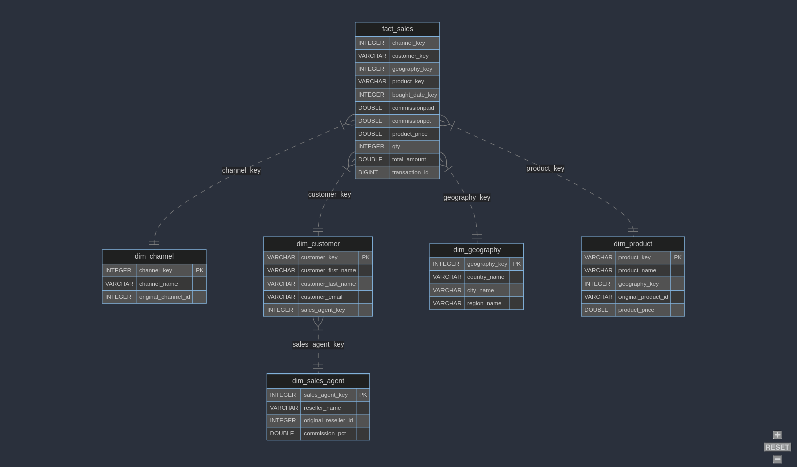

# Postcard Company Datamart

This project is a learning-by-doing data model build with `dbt-core` for an imaginary company selling postcards.

The company sells both directly but also through resellers in the majority of European countries.

This model is used by my other projects:
- [Portable Data Stack with Mage](https://github.com/cnstlungu/portable-data-stack-mage)
- [Portable Data Stack with SQLMesh](https://github.com/cnstlungu/portable-data-stack-sqlmesh)
- [Portable Data Stack with Dagster](https://github.com/cnstlungu/portable-data-stack-dagster)
- [Portable Data Stack with Airflow](https://github.com/cnstlungu/portable-data-stack-airflow)
- [Postcard Company Dataform](https://github.com/cnstlungu/postcard-company-dataform)

# Data model

 

## Layers

- `raw` unrefined input data
- `staging` staging area
- `core` curated data

## Dimensions
- dim_channel
- dim_customer
- dim_date
- dim_geography
- dim_sales_agent

## Facts
- fact_sales

# Getting started

The data is generated as parquet files by a Python script `generator/generate.py` using user-defined assets `assets.py`. These may be adjusted as per needs.

## Setting up the project

1. Rename `.env.example` to `.env`. This will contain relative paths for the database file (datamart.duckdb) and parquet input files

2. Rename `shared\db\datamart.duckdb.example` to `shared\db\datamart.duckdb` or initiate an empty database there with the same name.

3. Create a Python Virtual Environment (ensure at least Python 3.10 is installed)

`uv venv .venv`

4. Activate the Python venv

`source .venv/bin/activate`

5. Add environment variables to the virtual environment

`cat .env >> .venv/bin/activate`

6. Install the required packages with `uv pip`

`uv pip install -r requirements-ci.txt`

7. Generate the data

`python generator/generate.py`

The generated data will be under `shared/parquet`.

## Running the dbt model

1. Ensure the virtual environment is activated

`source .venv/bin/activate`

2. Run `dbt deps` to install dependencies

`dbt deps --project-dir postcard_company`

3. Run `dbt seed` to import the seed (static) data

`dbt seed --project-dir postcard_company`

4. Run `dbt compile` to compile the project

`dbt compile --project-dir postcard_company`

5. Run `dbt run` to run the models

`dbt run --project-dir postcard_company`

6. Run `dbt test` to run the tests

`dbt test --project-dir postcard_company`
