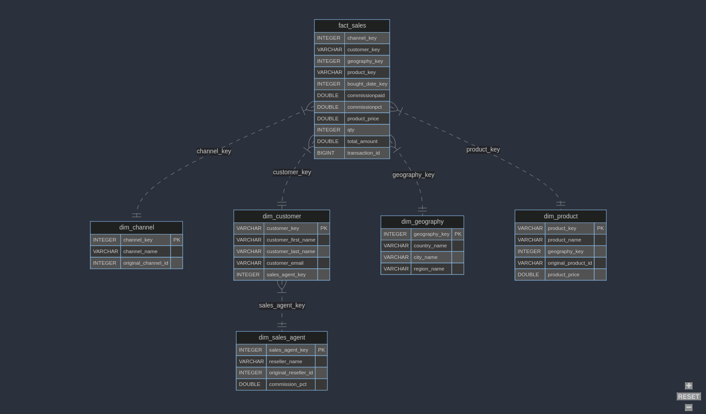

# Postcard Company Datamart

This project is a learning-by-doing data model build with `dbt-core` for an imaginary company selling postcards.

The company sells both directly but also through resellers in the majority of European countries.

This model is used by my other projects:
- [Portable Data Stack with Mage](https://github.com/cnstlungu/portable-data-stack-mage)
- [Portable Data Stack with SQLMesh](https://github.com/cnstlungu/portable-data-stack-sqlmesh)
- [Portable Data Stack with Dagster](https://github.com/cnstlungu/portable-data-stack-dagster)
- [Portable Data Stack with Airflow](https://github.com/cnstlungu/portable-data-stack-airflow)
- [Postcard Company Dataform](https://github.com/cnstlungu/postcard-company-dataform)

# Data model

 


## Layers

- `raw` unrefined input data
- `staging` staging area
- `core` curated data

## Dimensions
- dim_channel
- dim_customer
- dim_date
- dim_geography
- dim_sales_agent

## Facts
- fact_sales


# Getting started

The data is generated as parquet files by a Python script `generator/generate.py` using user-defined assets `assets.py`. These may be adjusted as per needs.


## Setting up the project

1. Rename `.env.example` to `.env`. This will contain relative paths for the database file (datamart.duckdb) and parquet input files

2. Rename `shared\db\datamart.duckdb.example` to `shared\db\datamart.duckdb` or initiate an empty database there with the same name.

3. Create a Python Virtual Environment (ensure at least Python 3.10 is installed)

`uv venv .venv`

4. Activate the Python venv

`source .venv/bin/activate`

5. Add environment variables to the virtual environment

`cat .env >> .venv/bin/activate`

6. Install the required packages with `uv pip`

`uv pip install -r requirements-ci.txt`

7. Generate the data

`python generator/generate.py`

The generated data will be under `shared/parquet`.

The generator is seeded, so the same inputs always produce the same dataset.
Four environment variables control it:

| Variable | Default | Effect |
|---|---|---|
| `SEED` | `42` | Seeds both `random` and `Faker`. Change it for a different but still repeatable dataset. |
| `N_TRANSACTIONS` | `1000000` | Number of direct-sale transactions. Each reseller feed adds a further 100,000 rows. |
| `DATA_WINDOW_MONTHS` | `24` | Sales are spread over this many months, ending on `DATA_END_DATE`. |
| `DATA_END_DATE` | today | Last day sales can fall on, as an ISO date. Defaults to today so the data is never stale; pin it to reproduce an earlier dataset exactly. |

`SEED` alone does not make a run reproducible **across days**, because the date
window moves with the calendar. To regenerate a dataset byte for byte, pin both:

```bash
SEED=42 DATA_END_DATE=2026-09-13 python generator/generate.py
```

For a quick run:

`SEED=42 N_TRANSACTIONS=20000 python generator/generate.py`

The window also has to stay inside `dim_date`, whose range is declared once as
the `calendar_start` / `calendar_end` vars in
[`postcard_company/dbt_project.yml`](postcard_company/dbt_project.yml) and
mirrored by `CALENDAR_START` / `CALENDAR_END` in the generator. Sales outside
that calendar would produce `fact_sales` rows whose `bought_date_key` joins to
nothing, so the generator refuses to run and names the setting to change. To
model a longer history, widen the calendar in both places — CI checks that they
agree, and a `relationships` test on `bought_date_key` catches any breach that
reaches the warehouse.

After changing the generator, check it with:

```bash
python generator/checks.py
```


## Running the dbt model

1. Ensure the virtual environment is activated

`source .venv/bin/activate`

2. Run `dbt deps` to install dependencies

`dbt deps --project-dir postcard_company`

3. Run `dbt seed` to import the seed (static) data

`dbt seed --project-dir postcard_company`

4. Run `dbt compile` to compile the project

`dbt compile --project-dir postcard_company`

5. Run `dbt run` to run the models

`dbt run --project-dir postcard_company`

6. Run `dbt test` to run the tests

`dbt test --project-dir postcard_company`


## Upgrading an existing warehouse

The models under `staging/` and `core/` are incremental, so they keep rows that
are already there. That is fine while transaction IDs are stable, but any change
that **renumbers** them — upgrading across a generator change, or regenerating
with a different `N_TRANSACTIONS` — leaves the old rows in place alongside the
new ones. The symptoms are inflated row counts, dimension keys in `fact_sales`
that no longer resolve, and a failing uniqueness test.

`dbt run` on its own will not repair this: the incremental filter only adds. Full
refresh the two reseller models and everything downstream of them:

```bash
dbt run --full-refresh --project-dir postcard_company \
  --select staging_reseller_type1_sales+ staging_reseller_type2_sales+
```

The `+` matters — it pulls in `staging_transactions` and `fact_sales`, which are
built from those models. Refreshing the reseller models alone leaves `fact_sales`
holding rows keyed on the old IDs.

`staging_transactions_main` is not in that set: direct-sale IDs are assigned
before the reseller feeds, so they do not move when the reseller numbering does.

Then confirm:

```bash
dbt test --project-dir postcard_company
```

CI exercises this path on every run, so the command above is kept honest.
